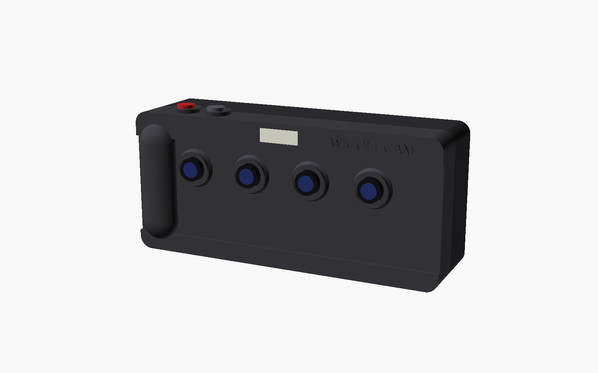
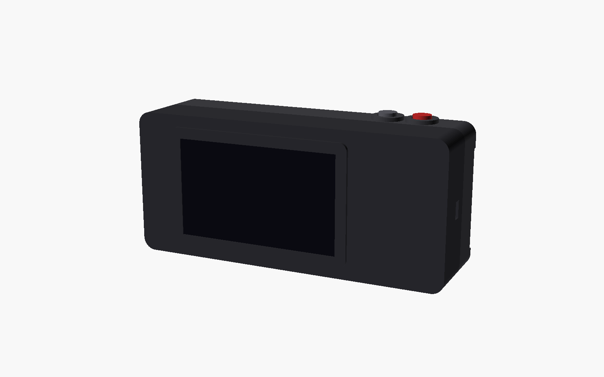
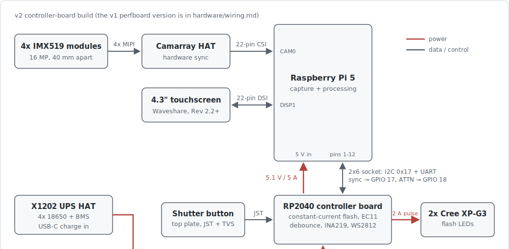

# WiggleCam: a 4-lens digital wigglegram camera

A handheld camera with four lenses that all fire at the same instant.
It splices the four views into a bouncing 3-D "wigglegram" GIF, the
same effect as the old Nishika N8000 film camera, but digital. The
touchscreen on the back shows a live preview and a filter carousel,
and after every shot it puts up a QR code so you can pull the GIF onto
your phone over the camera's own Wi-Fi hotspot. No app, no cable.

> Status: design and firmware are done. Next step is ordering parts
> and building it.

<p align="center">
  
  
</p>

## How it works

Four 16 MP camera modules sit 40 mm apart behind the faceplate. They
all connect to an Arducam "Camarray" HAT, which clocks the four
sensors together and merges them into one 2x2-stitched frame. The Pi
just sees a single normal camera on one ribbon cable, but the four
exposures inside that frame happened at the same instant. That
hardware sync is the whole trick: if the frames were even a few
milliseconds apart, anything moving (people, hair, leaves) would ghost
between views and the 3-D effect falls apart. You can't fix that in
software after the fact.

The firmware splits the stitched frame into four views, lines them up
on the subject (OpenCV phase correlation on a center crop), applies
the selected filter, and writes a GIF that bounces 1-2-3-4-3-2-1. My
reasoning for each design decision is in
[docs/architecture.md](docs/architecture.md).



## Controller board

The flash and controls run through a separate board that lives in its
own repo:
[wigglecam-controller](https://github.com/jadenrhee/wigglecam-controller).
It's an RP2040 co-processor that sits between the Pi and the physical
hardware and takes over the timing-critical and analog jobs: driving
the flash LEDs at a set current with safety limits enforced in
hardware, debouncing the shutter button, reading the rotary encoder,
measuring battery voltage and current, and pulsing a sync line so the
capture lands inside the flash window. The Pi talks to it over I2C.
The board is 76x50 mm, 4 layers, and passes JLCPCB's design rule
checks with zero violations.

The schematic for that board isn't drawn in a GUI, it's Python code
(SKiDL), and the layout is generated by scripts. The whole pipeline is
documented in that repo.

<p align="center">
  
  
</p>

The routing view above shows front copper in red and back copper in
blue, with the ground/power planes hidden so you can actually see the
traces.

## Repo layout

| Path | Contents |
|------|----------|
| [hardware/BOM.md](hardware/BOM.md) | full parts list (~$550-620) and why each part works with the others |
| [hardware/wiring.md](hardware/wiring.md) | both electronics versions: block diagrams, pin maps, flash schematic, assembly order |
| [hardware/power-budget.md](hardware/power-budget.md) | load table, the flash transient, runtime estimate |
| [hardware/safety-checklist.md](hardware/safety-checklist.md) | battery, electrical, and thermal checks. Read this first |
| [firmware/](firmware/) | Python app: capture, filters, alignment, GIF export, share server, touch UI |
| [enclosure/](enclosure/) | parametric OpenSCAD body + printing guide (you don't need to own a printer) |

## Design choices, short version

- **LED flash instead of xenon.** Xenon needs a ~300 V charge circuit,
  which I did not want inside a handheld device I'm hand-assembling.
  LEDs run at 5 V, and syncing them is easy because you can just hold
  them on for the whole capture window.
- **One battery board rated for the job.** The Pi 5 wants 5 V at up to
  5 A, which is more than most power banks will push. The X1202 UPS
  HAT (four 18650 cells with battery management built in) is made for
  exactly this.
- **QR sharing instead of AirDrop.** AirDrop is Apple-proprietary and
  can't be implemented on a Pi. A Wi-Fi hotspot plus a QR code works
  on every phone with zero setup.

## Running the firmware (on the Pi)

```bash
sudo apt install -y python3-picamera2 python3-pyqt5 python3-opencv
python3 -m venv --system-site-packages .venv && source .venv/bin/activate
pip install -r firmware/requirements.txt
echo 'dtoverlay=imx519,cam0' | sudo tee -a /boot/firmware/config.txt && sudo reboot
# after reboot:
nmcli device wifi hotspot ssid WiggleCam password <choose-one>
cd firmware && python3 -m wigglecam.app
```
