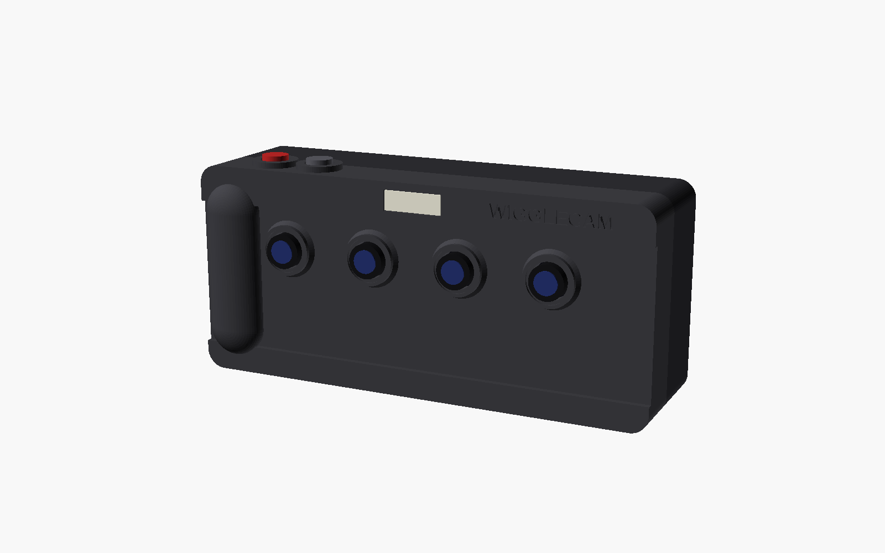
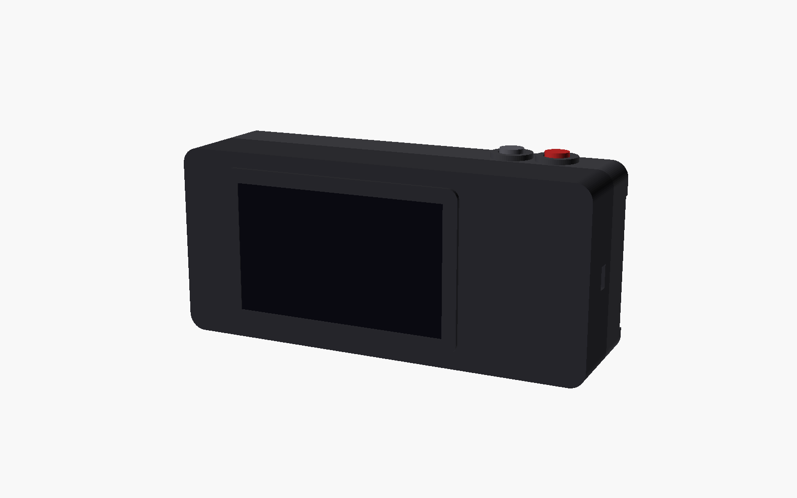
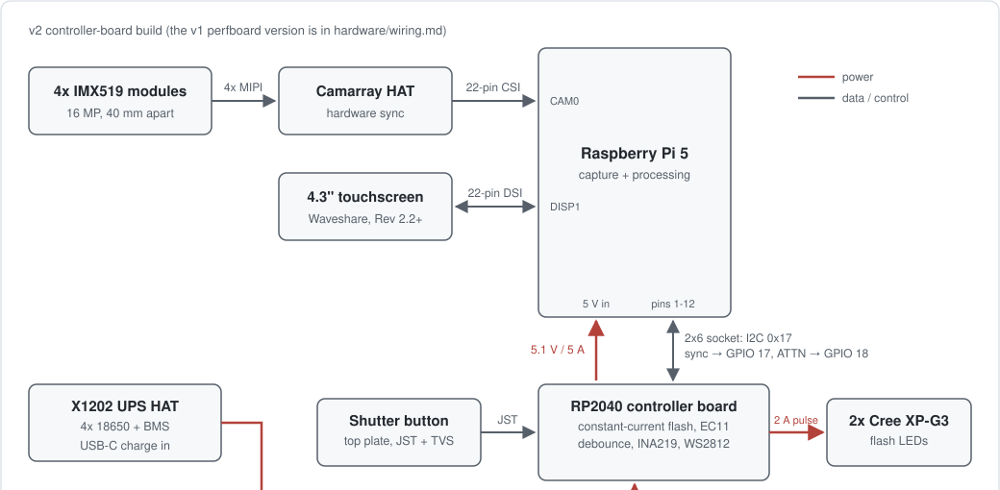
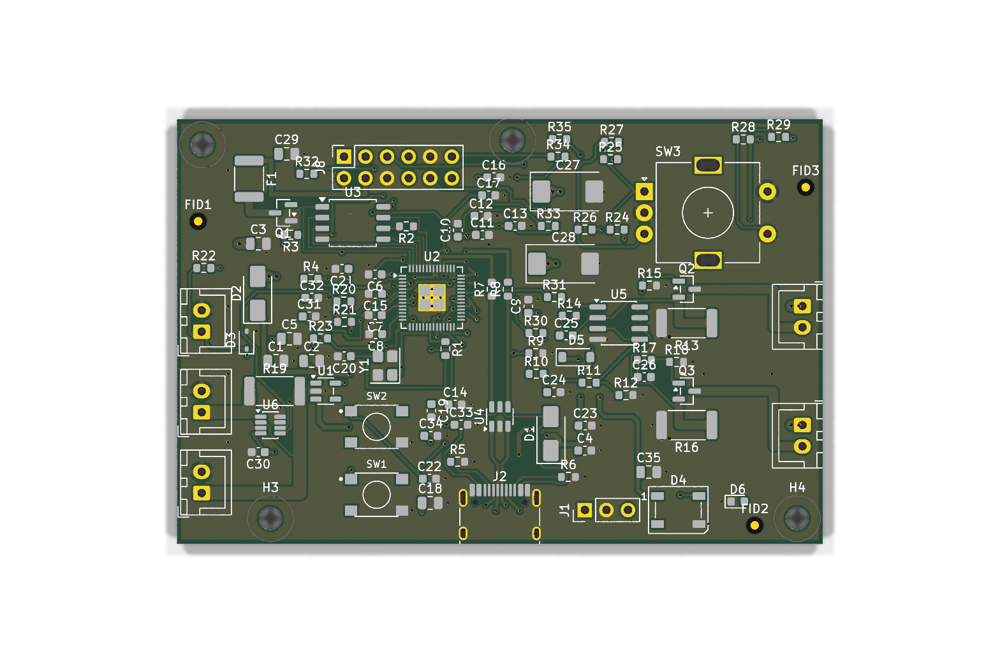
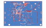

# WiggleCam

A camera I designed with four lenses that all fire at the same moment.
You get four slightly different views of one scene, and flipping through
them makes the photo look 3-D. It's a digital version of the Nishika
N8000, an old film camera I've wanted for a while.

There's a touchscreen for the preview and filters, and after every shot
it puts a QR code on the screen so anyone can pull the GIF onto their
phone over the camera's own wifi.

The design and the firmware are done. I haven't ordered parts yet, so
everything here is renders and math rather than photos.

<p align="center">
  
  
</p>

## How it works

Four 16 MP camera modules sit 40 mm apart behind the front plate. They
plug into an Arducam Camarray HAT, which runs all four off one clock and
packs them into a single 2x2 image before it reaches the Pi. Sharing one
frame means each view comes out around 4 MP. That's the price of getting
them synced this way, and for a GIF it's plenty.

The clock is why I went with that HAT. Four cameras triggered by
software drift apart by milliseconds, so anything moving lands somewhere
different in each frame and jumps around instead of shifting smoothly.
One clock avoids that.

Then the software splits the frame back into four and lines them up on
the subject, using phase correlation on a center crop, so only the
background shifts. It adds the filter and writes a GIF that bounces back
and forth.



## The controller board

Linux isn't a real-time OS, so I can't count on the Pi to hit an exact
moment. The jitter shows up as the flash firing outside the exposure. So
I designed a second board for the timing-critical parts:
[wigglecam-controller](https://github.com/jadenrhee/wigglecam-controller).

An RP2040 on that board runs the flash and sends the Pi a pulse the
instant the LEDs hit full current. It also debounces the shutter, reads
the encoder, and watches battery voltage and current. The Pi drives it
over I2C at address 0x17, and two separate GPIO lines run back the other
way, one for the capture pulse and one for button and knob events.

It's 76 x 50 mm and 4 layers. DRC comes back clean against JLCPCB's
published rules, and I measured 24 more things off the finished layout
myself. It isn't fabricated yet either.

<p align="center">
  
  
</p>

## What's in here

| Path | What it is |
|------|----------|
| [hardware/BOM.md](hardware/BOM.md) | everything you'd need to buy, about $550 |
| [hardware/wiring.md](hardware/wiring.md) | what connects to what, and the order I'd build it in |
| [hardware/power-budget.md](hardware/power-budget.md) | where the power goes, and the math that says it should run about 4.5 hours |
| [hardware/safety-checklist.md](hardware/safety-checklist.md) | the lithium and heat rules I'm holding myself to. The cells are unprotected by design, so the BMS and these checks are the whole safety story |
| [firmware/](firmware/) | the Python app that runs the camera |
| [enclosure/](enclosure/) | the 3D printable case, plus how to get it printed |
| [docs/architecture.md](docs/architecture.md) | why I picked what I picked |

## Running it (on the Pi)

```bash
sudo apt install -y python3-picamera2 python3-pyqt5 python3-opencv
python3 -m venv --system-site-packages .venv && source .venv/bin/activate
pip install -r firmware/requirements.txt
echo 'dtoverlay=imx519,cam0' | sudo tee -a /boot/firmware/config.txt && sudo reboot
# after reboot:
nmcli device wifi hotspot ssid WiggleCam password <choose-one>
cd firmware && python3 -m wigglecam.app
```
